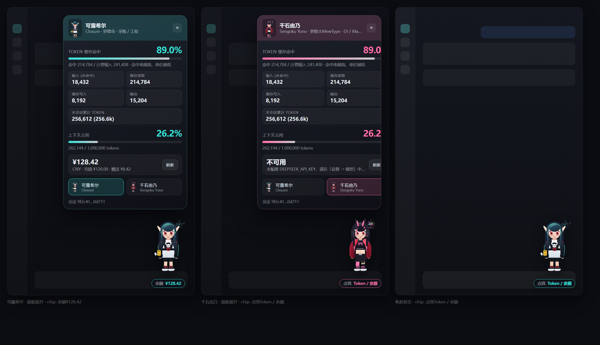
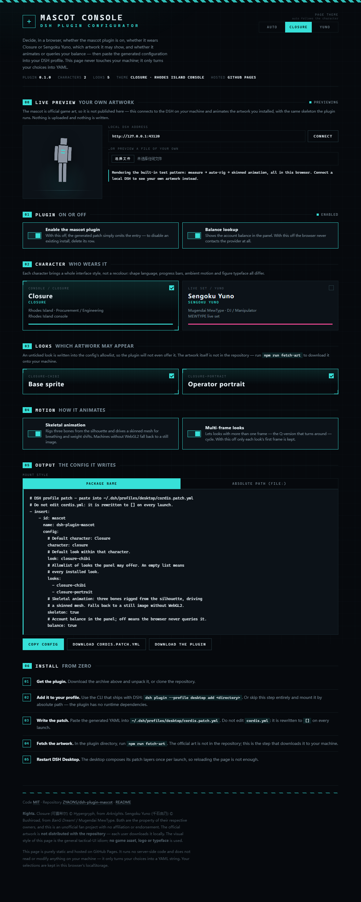

# dsh-plugin-mascot · DSH 看板娘

[English](README.md) | 中文

给 **DeepSeek Harness**（DSH）Web GUI 加一个可以点的看板娘：平时缩在右下角，
点一下弹出一块面板，把这一局到底花了多少钱、命中率怎么样，一次说清楚。

- **Token 缓存命中率** —— 命中读取 ÷ 全部计费输入（命中率越高，单价越低）
- **Token 明细** —— 输入（未命中）/ 缓存读取 / 缓存写入 / 输出 / 本会话累计
- **上下文占用** —— 当前占用 ÷ 上下文窗口，带进度条
- **账户余额** —— 主机侧向 DeepSeek 查询，API Key 不进浏览器
- **两个角色、五套官方形象，随时切换** —— 可露希尔（罗德岛）× 千石由乃（梦限大 MewType）
- **一人一套界面风格** —— 可露希尔的「罗德岛工程终端」和由乃的「MEWTYPE LIVE」是两套
  不同的设计，不只是换个颜色
- **立绘会动，而且是骨骼动画** —— 按轮廓自动绑骨 + 网格蒙皮，会呼吸、会摆重心、头先动；
  两帧的 Q 版还会真的转身



> 上面这张预览图是 `lib/client.js` 在真实 Chromium 里跑出来的（开面板、切角色、切形象
> 全是真 DOM 点击），用的是**内置占位图** —— 也就是刚 clone 下来、还没跑
> `npm run fetch-art` 时的样子。装了官方素材之后的样子见 `docs/preview-official.png`
> （本地生成，不进仓库）。

---

## 目录

- [安装](#安装)
- [形象](#形象)
- [风格](#风格)
- [动态](#动态)
- [使用](#使用)
- [配置](#配置)
- [网页配置台](#网页配置台)
- [它是怎么工作的](#它是怎么工作的)
- [数据从哪来](#数据从哪来)
- [开发](#开发)
- [素材与授权](#素材与授权)

---

## 安装

DSH Desktop 通过 **profile 目录里的 `cordis.patch.yml`** 加载插件。
`cordis.yml` 每次启动都会被改写成 `[]`，**不要动它**。

本插件**没有任何运行时依赖**（主机半边一个 `import` 都没有），所以有两条路，
任选其一。

### 方案 A —— 不需要安装（最省事）

直接在 patch 行里用绝对 `file:` URL 指向主机半边：

```yaml
# ~/.dsh/profiles/desktop/cordis.patch.yml
- insert:
    - id: mascot
      name: 'file:///C:/Users/<你>/Desktop/kexier/dsh-plugin-mascot/lib/index.js'
```

注意 `file:` URL 要指向**文件**而不是目录。写相对路径
`./dsh-plugin-mascot/lib/index.js` 也可以，它相对于 patch 文件所在目录解析。

### 方案 B —— 装成 profile 的真依赖

用 DSH 自带的 CLI（它只是把参数原样转发给 profile 目录里的 pnpm）：

```bash
dsh plugin --profile desktop add "C:\Users\<你>\Desktop\kexier\dsh-plugin-mascot"
```

也可以 `link:` / `file:` 显式指定，或直接从 git 安装：

```bash
dsh plugin --profile desktop add link:/absolute/path/to/dsh-plugin-mascot
dsh plugin --profile desktop add "github:ZYAONS/dsh-plugin-mascot"
```

然后按包名挂载：

```yaml
- insert:
    - id: mascot
      name: dsh-plugin-mascot
```

两种都行；**方案 A 更保险** —— 它完全不会动 profile 的依赖树。

### 配置

两种写法都可以加 `config`（字段见[配置](#配置)）：

```yaml
- insert:
    - id: mascot
      name: dsh-plugin-mascot
      config:
        baseUrl: 'https://api.deepseek.com'
        cacheTtlMs: 30000
```

### 重启 DSH Desktop

**必须重启整个应用。** DSH Desktop 不会监听 profile 目录 —— `patchReload: live`
只在 CLI 路径上生效；桌面端只在启动时组合一次 patch 层。刷新网页没用，
插件根本没进这一代的加载树。重启之后它就在了；之后再改 `lib/client.js`
的内容会通过客户端 HMR 热更新，不用再重启。

---

## 网页配置台

在**浏览器里**决定这个插件怎么装、用哪个角色，不用先装到本机：

**https://zyaons.github.io/dsh-plugin-mascot/**



- **00 实时预览** —— 立绘**从你自己机器上取**：连你正在跑的 DSH，用和插件同一套骨骼
  渲染你装好的素材。官方立绘不在仓库里，这是唯一诚实的展示方式。连不上时可以丢一个
  自己的图片文件进去 —— 测量与绑骨全在浏览器里完成，文件不会上传 —— 或者用
  `?preview=test` 看内置的骨骼测试图案。
- **01 插件开关** —— 插件本身开 / 关，余额查询开 / 关
- **02 角色** —— 可露希尔（罗德岛工程终端）还是千石由乃（MEWTYPE LIVE）
- **03 形象** —— 勾选允许出现的立绘；勾掉的会写进 allowlist，插件连列都不列
- **04 动效** —— 骨骼动效、多帧形象
- **05 输出** —— 生成可直接粘贴的 `cordis.patch.yml`，一键复制或下载
- **06 安装** —— 五步走完，含素材下载与重启

### 两套网页主题

配置台自带两位角色的界面风格，在页头切换 —— 而且不是换个颜色就算数：

| | 可露希尔 | 千石由乃 |
|---|---|---|
| 底色 | 蓝黑 | 紫黑 |
| 信号色 | 青 `#37e0d8` | 洋红 `#ff4d9d` |
| 直角 / 圆角 | 直角 | 14px 圆角 |
| 选中提示 | 四角括号 | 辉光 |
| 标签字体 | 等宽 | 圆体 |
| 警示胶带 | 青色 | 洋红 |

默认是 **Auto（跟随角色）** —— 在 02 区选了由乃，整页就跟着变成由乃的配色，
所以配置台本身就是「插件会长什么样」的实时预览。手动指定主题则会钉住不再跟随，
高亮的那颗按钮永远告诉你现在是哪一个在生效。

### 语言

配置台是**英文**的，插件面板本身仍是中文。这个分工是有意的：配置台是别人第一眼看到的东西，
面板是运营者每天要读的东西。需要两种语言的文案只有一份来源 ——
`art/looks.json` 里 `nameEn` / `roleEn` / `taglineEn` 就写在插件的
`name` / `role` / `tagline` 旁边，`build-site.mjs` 把英文那套拷进配置台的目录。
给插件加一套形象，改一个文件就同时有了英文名；`check-site` 会在「要渲染的记录缺翻译」
或者「页面上除了版权声明又冒出中文」时直接失败。

两套主题都支持深链，这也是它们能在无头浏览器里被断言的原因（不用模拟点击）：

```
?theme=auto|closure|yuno      ?character=closure|yuno
```

### 让配置台读到你的素材

实时预览是一次跨域读取，而那条路由平时是带会话门禁的，所以插件为它准备了一份精确匹配的白名单：

```yaml
config:
  # 允许免会话读取 /art/ 的来源。留空数组就完全关掉配置台预览。
  artOrigins: ["https://zyaons.github.io"]
```

这个口子**只开在 `/art/`** —— 余额和形象索引仍然要 DSH 的会话 cookie；
不在名单上的来源会被 401 拒绝，且不会拿到任何关于自己的信息。

页面是**纯静态**的，托管在 GitHub Pages 上，**不跑任何服务端代码，也不读取或修改你本机的任何东西** ——
它只是把你的选择拼成一段 YAML 文本。所有状态存在浏览器 localStorage 里。

配色与排版参考了一般性的战术界面设计语言（近黑底、单一信号色、直角、发丝线、
拉丁大写标签压中文），**没有**使用任何游戏素材、Logo 或字体。

页面读的形象清单来自 `docs/site/catalog.json`，由 `scripts/build-site.mjs`
从 `art/looks.json` 生成 —— 和插件读的是同一份声明，不会两边不一致。
`scripts/check-site.mjs` 用 **Chrome DevTools Protocol** 真跑这个页面 —— 真浏览器、真派发点击、真控制台输出。
**它生成的 YAML 里的每个 id 都真实存在**（拼错一个就会让插件静默退回第一套形象），以及**两套主题在六个 token 上确实不同**（只比一个强调色的话，那是换色不是换主题）。

---

## 形象

看板娘用的是**画师产出的官方素材**，不是手绘图。但官方图版权属于鹰角和 Bushiroad，
把图片塞进公开仓库等于替别人分发受版权保护的素材 —— 所以本仓库**只带下载清单，
不带图片**：

```bash
npm run fetch-art              # 下载 + 自动抠图 + 自动同步索引
npm run fetch-art -- --force   # 强制重下
```

| 角色 | 形象 | 素材 | 处理 |
|---|---|---|---|
| 可露希尔 | 基建小人 | 官方 Q 版干员小人（512×640，透明，含悬浮无人机） | 直接用 |
| 可露希尔 | 官方立绘 | 官方干员立绘（1024×1024，透明） | 直接用 |
| 千石由乃 | 动画 | 官方动画立绘（1550×2085，透明） | 直接用 |
| 千石由乃 | 常服 | 官方动画常服立绘（粉发眼镜版，1499×2088，透明） | 直接用 |
| 千石由乃 | Q 版 | 官方 Q 版初代双姿势版式 | **自动抠图 → 拆成 2 帧** |

`art/looks.json` 是手写的清单，`art/index.json` 是 `art-sync` 生成的索引。
每一项都写了来源 URL 和 **sha256**，脚本逐个校验，上游文件变了会明确报出来
（但仍然写入，免得你手上什么都没有）。

### 加一套形象

不用改任何代码：

1. 在 `art/looks.json` 的 `looks` 里加一条（`id` / `character` / `name` / `urls` / `rights`）；
2. `npm run fetch-art`。

`scripts/art-sync.mjs` 会用真浏览器量出每张图的 **alpha 边界框**，据此算出两个座位
（浮动立绘 104×172、面板头像 38×50）的取景参数，再从人物主色里采一个强调色。
也就是说：**取景数字和配色都是量出来的，不是手填的**。量完写进 `art/index.json`，
主机半边读它、按文件是否在盘上过滤，再发给浏览器。

### 会自动同步

- `npm run fetch-art` 跑完会**自动调用** `art-sync`，索引立刻更新；
- `npm run art:sync` 单独同步一次；
- `npm run art:watch` 常驻监听 `art/`，**丢一张图进去就自动重新测量并更新索引**，
  刷新页面即可看到新形象 —— 不用重启、不用改代码。

### 没装素材也能用

内置一个**中性占位图**（虚线框 + 「图片缺失」图标），官方图 404 时自动顶上，
面板里还会提示去跑 `fetch-art`。占位图是通用图形，不是任何角色的画像。

---

## 风格

**一人一套界面风格**，不是换个主色就算数 —— 两套主题在**形状语言、数据可视化方式、
环境动效、数字字体**四处都不同：

| | 可露希尔 · 罗德岛工程终端 | 千石由乃 · MEWTYPE LIVE |
|---|---|---|
| 形状 | 方角（6px），工程仪器感 | 圆角（18px），软糖感 |
| 进度条 | **分段刻度**，像仪表盘 | **VU 表**，带辉光 |
| 环境动效 | 扫描线上下扫过 | 脉冲圆环 + 跳动均衡器 |
| 头像 | 圆角矩形 | 圆形 + 辉光描边 |
| 数字字体 | 等宽（工程读数） | 圆体（演出感） |
| 顶栏标签 | `罗德岛 · 工程终端` | `MEWTYPE · LIVE` |

主题定义在 `lib/client.js` 的 `THEMES` 里，按 `art/looks.json` 里角色的 `theme`
字段选择 —— 加一个新角色，在清单里写上主题名即可自动套用。

---

## 动态

立绘会动，分三层。前两层是**真骨骼动画**，第三层是浏览器原生播放。

### 1. 骨骼动效（默认开，可在面板里关）

自己写的一套 **2D 骨骼 + 网格蒙皮**渲染器：

- **自动绑骨**：`art-sync` 顺便量出每张图的**轮廓剖面**（32 条横向切带的左右边界）。
  客户端据此找**脖子** —— 那就是轮廓收窄的那一带。之所以要「找」而不是写死，
  是因为 Q 版小人的头占了大半个身子，而全身立绘的头只占十分之一，一个固定比例
  不可能同时套住两者。
- **三根骨头成链**：`root`（枢轴在脚下，管整体摇摆与弹跳）→ `spine`（枢轴在胯，
  管上半身）→ `neck`（枢轴在脖子，管头）。子骨继承父骨的变换，所以头会**跟着身体动**，
  而不是各动各的。
- **蒙皮**：顶点权重只按**纵向**分配（三根骨头沿高度叠加，在关节处用平滑带过渡）——
  这是单张平面图唯一不会撕裂的轴。
- **渲染**：WebGL2 里做线性混合蒙皮（每个顶点 3 个权重），贴图以
  `UNPACK_PREMULTIPLY_ALPHA_WEBGL` 上传，所以边缘过滤不会留下黑边。
- **幅度刻意很小**：待机摆 ±1.5°、点头 ±2.4°、呼吸 ±1.1%、起伏 0.6%。平面图上大角度
  只会像橡皮，不像呼吸。点击会叠一个**衰减振荡**（squash & stretch + 点头），
  按点击时刻计时，1.6 秒后归零。

**做不到的**：真正的 Live2D / Spine 骨骼动画。游戏里的动态小人是 Spine 工程，而且
明日方舟用的是**改过的 Spine 3.8 格式** —— 官方骨骼文件在公开 CDN 上是 404/403，
原版运行时也吃不下（社区专门写 Ark-Models 这类工具就是因为这个）。所以这里没有
预设的骨骼动画可以加载，只能自己从静图推骨。上面那套就是这个方案的诚实描述：
**它让一张静态立绘像站着的人那样呼吸、重心偏移、头先动**，但它不是角色级完整骨架，
也没有手臂骨骼（单张平面图里手臂和躯干重叠，独立驱动会撕图）。

跑不动就自动退回静图：没有 WebGL2、上下文被拒、着色器编译失败、图片跨域被污染 ——
任何一步失败都渲染普通 ``。所以这个功能**只可能增加动效，不可能让人物消失**。
预览脚本里有一条 `rig: ON (canvas 140x232)` 就是用来盯这件事的。

### 2. 多帧动画

由乃的 Q 版原图是**两个姿势**。`cutout.mjs` 用 `mode: "all"` 保留两个连通域、
各自裁到自己边界、**共用同一缩放比例**（否则侧面姿势会被放大、看起来像在长大），
浏览器每 5.2 秒交叉淡化一次 —— 效果是她慢慢转身。
装了骨骼动效时这条自动让位（两套动效同时跑会互相打架）。

### 3. 动图直通

清单里任意一帧是 GIF / 动图 WebP，浏览器原生就会播放，不需要额外处理。

---

## 使用

| 操作 | 结果 |
|---|---|
| 点右下角的立绘 | 展开 / 收起面板 |
| 面板里「角色」一行 | 切换看板娘 |
| 面板里「形象」一行 | 切换这个角色的立绘（带「动态」角标的是多帧动画） |
| 点空白处 或 按 `Esc` | 关掉面板 |
| 面板里「动效」一行 | 开关骨骼动效（本机不支持时会显示「不可用」） |
| 点「刷新」 | 立刻重新问一次余额（默认 2 分钟自动刷新一次） |

选择存在 localStorage，下次打开还是这套。
勾选了系统「减少动态效果」（`prefers-reduced-motion`）时，所有动效自动关闭。

面板展开时，立绘下面的胶囊会显示余额；查询失败时显示「点我 Token / 余额」，
不会假装自己知道。

---

## 配置

全部字段都有默认值，`config` 可以整段不写。

| 字段 | 默认值 | 说明 |
|---|---|---|
| `routePrefix` | `/dsh-mascot` | 本插件在主机 webserver 上占用的路径前缀 |
| `baseUrl` | `https://api.deepseek.com` | 余额接口所在的提供方源站 |
| `apiKeyRef` | `DEEPSEEK_API_KEY` | 凭据服务里的引用名（`~/.dsh/.credentials.yaml`） |
| `cacheTtlMs` | `60000` | 一次余额查询的保鲜期；失败不缓存 |
| `timeoutMs` | `10000` | 上游请求超时 |
| `artDir` | 插件自己的 `art/` | 立绘所在目录，默认按插件位置推导 |

> 用的是中转站或自建网关时，把 `baseUrl` 指过去即可；只要它实现了
> `GET /user/balance`。

---

## 它是怎么工作的

一个插件包，两个半边：

```
dsh-plugin-mascot/
├── lib/
│   ├── index.js        主机半边：/dsh-mascot 路由（余额 + 形象索引 + 素材），查余额
│   └── client.js       浏览器半边：看板娘 + 面板 + 两套主题 + 骨骼蒙皮渲染器
├── art/
│   ├── looks.json      手写的形象清单：角色、主题、来源 URL、sha256（进仓库）
│   ├── index.json      art-sync 生成的索引：取景参数、强调色、帧列表（进仓库）
│   ├── closure-*.png   ← npm run fetch-art 下载，不进仓库
│   └── yuno-*.png      ← 同上（Q 版那张会先抠图再拆帧）
└── scripts/
    ├── fetch-art.mjs   按清单下载 →（需要时）抠图 → 自动调用 art-sync
    ├── cutout.mjs      真浏览器里抠背景；多姿势版式拆成对齐的多帧
    ├── art-sync.mjs    量 alpha 边界/主色 → 算取景 → 写 index.json；--watch 常驻
    ├── chrome.mjs      Chromium 定位（preview / cutout / art-sync 共用）
    ├── check.mjs       自检：清单与索引一致性、bundle 装载、统计函数、路由
    ├── preview.mjs     在真实浏览器里渲染 docs/preview*.png
    └── verify-profile.mjs  上线前体检：解析 patch 层、导入模块、检查浏览器半边
```

### 浏览器半边挂在哪个坑位

DSH 的 GUI 是一套 **slot 注册表**。本插件只注册了一个条目：

- **`shell.overlay`** —— 横跨整个窗口的浮层，层级在所有栏目之上、滚动容器之外。
  它是 `list` 类型的坑位，所以用一个全新的 `id: "mascot"` 就是**新增**而不是覆盖；
  这一层本身 `pointer-events: none`，所以立绘自己把 pointer 事件接回来，
  不会挡住下面的应用。

麻烦的地方在于：`shell.overlay` 是 `root` 作用域，**拿不到 `useProjection`**。
所以本条目在 `children` 里**自己声明了一个 `session-maybe` 作用域的子坑位
`mascot.panel`**，再通过 `props.renderSlot("mascot.panel", …)` 渲染面板 ——
渲染器会自动把 `useProjection` / `useSession` / `sessionId` 一并交给它。
用 `session-maybe` 而不是 `session`，是为了还没选会话时面板也能开。

### 主机半边

余额是浏览器够不着的那一个数字：问答需要 API Key，而 Key 不能离开主机进程。
形象也是浏览器自己拿不到的 —— 官方图不在仓库里，得由主机从磁盘上读、按安装情况过滤。
所以主机半边提供四条同源路由：

```
GET /dsh-mascot/api/balance   账户余额（带缓存）
GET /dsh-mascot/api/health    路由存活检查
GET /dsh-mascot/api/looks     有哪些形象装了，连带取景参数与强调色
GET /dsh-mascot/art/<文件>    从插件自己的 art/ 目录读素材
```

- Key 每次请求都用 `ctx.credentials.resolve()` 现取，**轮换后下一次调用即生效**，
  不需要重启；
- Key 只作为 `Authorization: Bearer` 头发出去，**绝不**进入响应体、日志或错误信息；
- 路由先过 `ctx.connection.isAuthenticated(req)`，也就是和 GUI 其余部分同一张
  浏览器 cookie；万一组合里没有 Connection 服务，退回到只接受回环 `Host`；
- 素材路由先做路径越界检查（`..`、编码分隔符一律 403），再限制扩展名，
  最后才落盘读文件；文件不在就 404，浏览器那边自动切到占位图；
- `/api/looks` 每次现读 `art/index.json` 并**按文件是否在盘上过滤** ——
  所以刚 clone 下来（索引在、图不在）会返回空，浏览器就用占位图，不会去猜。

---

## 数据从哪来

面板上的每个数字都来自 DSH 自己的**会话投影**（session projection），
不是本插件自己数的：

| 显示项 | 来源 | 形状 |
|---|---|---|
| Token 明细 | `useProjection("tokenUsage")` | `{ uncachedInputTokens, outputTokens, cacheReadTokens, cacheWriteTokens }` |
| Token 缓存命中 | 由上一行推导 | `cacheReadTokens ÷ (uncachedInputTokens + cacheReadTokens + cacheWriteTokens)` |
| 上下文占用 | `useProjection("contextPressure")` | `{ contextWindow?, pressureTokens?, projectedTokens? }`，优先用 `projectedTokens` |
| 账户余额 | 本插件的 `/dsh-mascot/api/balance` | `GET {baseUrl}/user/balance` |
| 可选形象 | 本插件的 `/dsh-mascot/api/looks` | 现读 `art/index.json`，按盘上文件过滤 |
| 立绘 | 本插件的 `/dsh-mascot/art/<文件>` | 磁盘上的 `art/`，缺失时用内置占位图 |

拿不到的数就显示 `—`，**不会**当成 0 —— 没有会话时命中率是没有意义的，
面板也不会编一个 0% 出来。

---

## 开发

```bash
npm install                # 只为 preview 装的 react / react-dom（devDependencies）
npm run fetch-art          # 下载形象 → 抠图 → 同步索引（一条龙）
npm run art:sync           # 只重新测量并写 art/index.json
npm run art:watch          # 常驻监听 art/，丢图进去就自动同步
npm test                   # 自检（27 项）
npm run check              # node --check 两个半边 + 自检
npm run preview            # 渲染 docs/preview.png（占位图，会进仓库）
npm run preview:official   # 渲染 docs/preview-official.png（官方图，不进仓库）
npm run verify             # 体检当前 profile 能不能挂上
```

单独跑抠图（多姿势版式会拆成多帧）：

```bash
node scripts/cutout.mjs <版式.png> <帧1.png> <帧2.png> --mode all
```

改取景**不需要手调数字**：`npm run art:sync` 会重新测量并写进索引。
如果你就是想手动干预，改 `art/index.json` 里对应帧的 `seat`，然后刷新页面。

改主题：编辑 `lib/client.js` 里的 `THEMES`，加一个新键，再让角色在
`art/looks.json` 里 `theme` 指向它。

---

## 素材与授权

- **代码**：[MIT](LICENSE)
- **官方素材（`art/*.png`，不进仓库）**：可露希尔的《明日方舟》官方 Q 版干员小人与
  官方立绘、千石由乃的《BanG Dream!》官方动画立绘 / 常服立绘 / Q 版形象。
  **版权归各自权利人所有，是画师产出的官方素材。** 本仓库不分发这些文件，
  只提供 `art/looks.json` 清单和 `npm run fetch-art` 下载脚本，由使用者自行下载到本机。
  个人自己用没问题；**再分发或商用请先取得授权**。
  `scripts/cutout.mjs` 对由乃的 Q 版版式做了抠图与拆帧 —— 处理的是像素，
  没有改动画面内容。
- **内置占位图**：`lib/client.js` 里的通用「图片缺失」图标（虚线框 + 图形符号），
  不描绘任何角色，仅在素材缺失时显示，同为 MIT。
- **角色权利**：可露希尔 © 上海鹰角网络（《明日方舟》）；千石由乃 © Bushiroad
  （《BanG Dream!》/ 梦限大 MewType）。二者均为各自权利人的商标／版权角色，
  本插件是非官方同人作品，与权利人无隶属或背书关系。
- **DSH**：DeepSeek Harness 及其 `@deepseek-ai/*` 包版权归其各自作者所有，
  本仓库只是在它的插件接口上工作。
